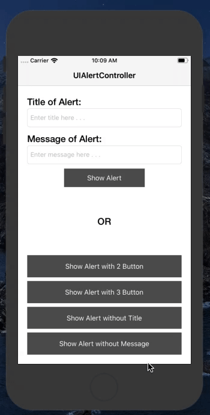

# AlertController

This is easy to use demo about UIAlertController with code held in one file and access in all other views. This demo is avaialble in both programming lanauage Objective-C & Swift.

# What is AlertController?

An object that displays an alert message to the user.

# Output:

# Basic Config:

1. Xcode 10.0 or above
2. Swift 4.0 or above
3. Development Target 10.0 or above
4. Device Universal Supported
